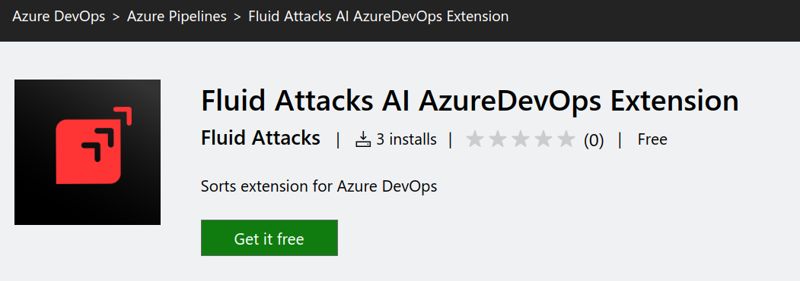
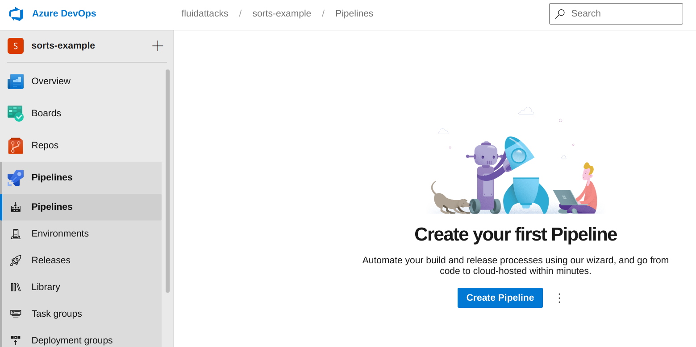
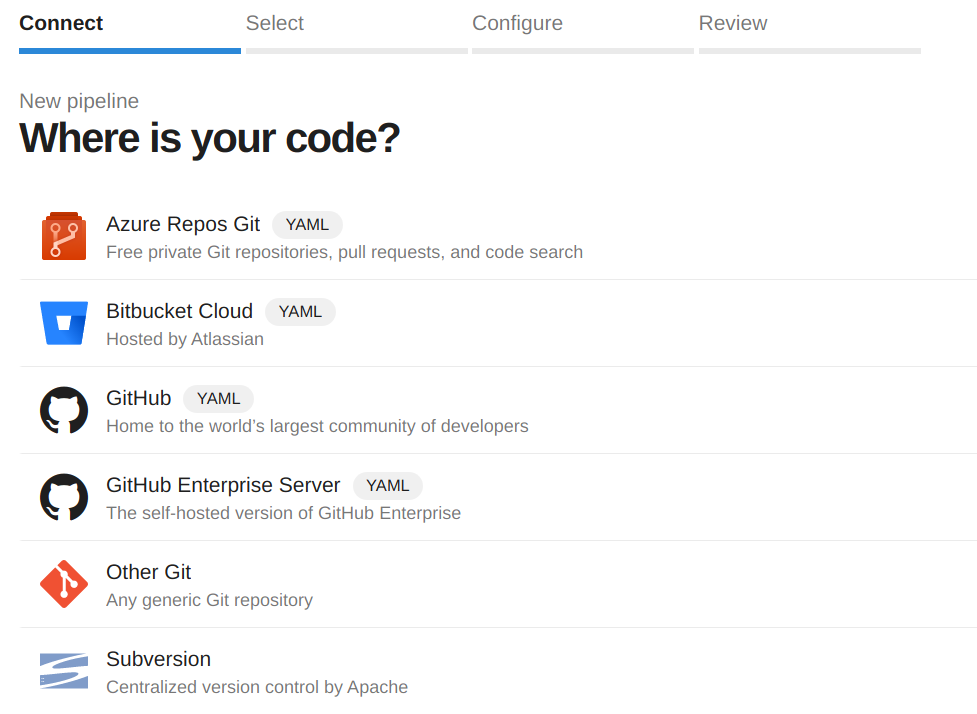
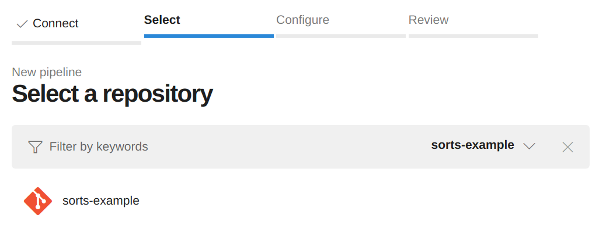
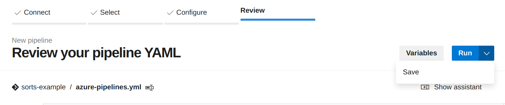
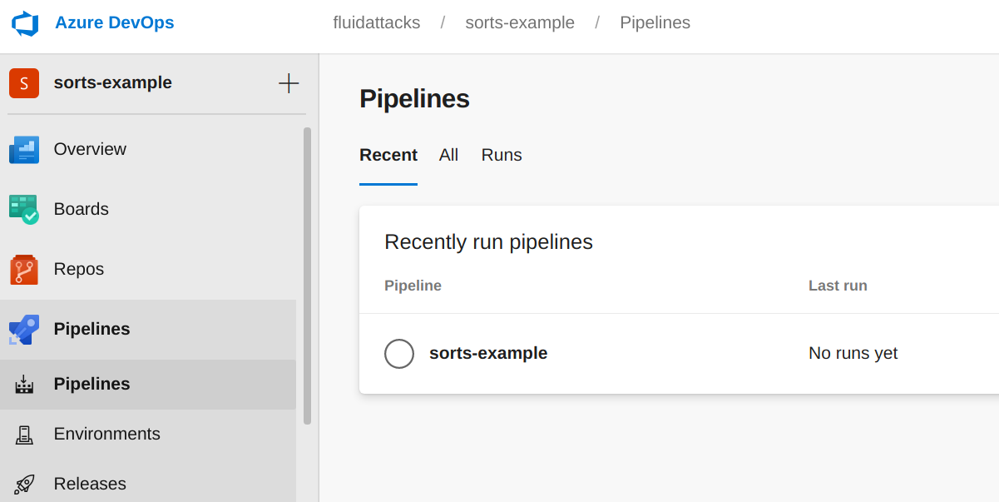

# Fluid Attacks AI

[Fluid Attacks](https://fluidattacks.com) AI
helps you detecting the files in your repository
that are more likely to contain security vulnerabilities,
enabling you to prioritize their review.

This repository contains an Azure DevOps extension
so you can use Fluid Attacks AI in your Azure projects.

## Getting started

### Requirements

1. An Azure account
1. An Azure organization and project
1. An Azure agent with:
    - Enough [parallel jobs](https://docs.microsoft.com/en-us/azure/devops/pipelines/licensing/concurrent-jobs?view=azure-devops&tabs=ms-hosted)
      as to be able to run a pipeline in your project
    - The following dependencies:
      - python3
      - python3-pip
      - python3-setuptools
1. Sufficient permissions to:
    - Install extensions from the
      [Visual Studio Marketplace](https://marketplace.visualstudio.com/)
    - Create Azure pipelines
      in the project
1. An active session (just login to your account)

### Install the extension

Please visit
[Fluid Attacks AI at the Marketplace](https://marketplace.visualstudio.com/items?itemName=FluidAttacks.sortsxtension)
and install it in your Azure organization
by clicking on the **Get it free** button.



### Setup Azure Pipelines in your project

> This step is optional
> if your project has already configured Azure Pipelines

In your project,
navigate to the pipelines section
and click in the **Create Pipeline** button.



Now follow the wizard.
Our code is located at **Azure Repos Git**:



Select the repository:



Finally click on **Save**.



At the end of this process we would have our first Azure Pipeline:



### Configuring the pipeline

Include it in your pipeline *yaml* definition file. Below, you have an example *yaml*.
You'll find that you need to set up a few input variables to Sorts. Most of them are just [Azure Build Environment Vars](https://docs.microsoft.com/en-us/azure/devops/pipelines/build/variables?view=azure-devops&tabs=yaml#pipeline-variables-devops-services). You will also need to have an Azure personal token. You can generate one following this [steps](https://docs.microsoft.com/en-us/azure/devops/organizations/accounts/use-personal-access-tokens-to-authenticate?view=azure-devops&tabs=preview-page).

```yaml
trigger:
- main

pool:
  name: Default

jobs:
- job: fluid_attacks_ai
  displayName: Fluid Attacks AI
  steps:
  - script: |
      python3 -m pip install --upgrade pip
      python3 -m pip install \
        category-encoders==2.3.0 \
        cryptography==35.0.0 \
        gitpython==3.1.20 \
        pandas==1.1.5 \
        prettytable==2.4.0 \
        requests==2.26.0 \
        tqdm==4.62.3 \

    displayName: Install dependencies
  - task: azure_sorts_test@0
    inputs:
      azureUsername: YOUR_PERSONAL_AZURE_USERNAME
      azureToken: YOUR_PERSONAL_AZURE_TOKEN
      repositoryUrl: "$(Build.Repository.Uri)"
      repositoryLocalPath: "$(Build.Repository.LocalPath)"
      buildSourceVersion: "$(Build.SourceVersion)"
      repositoryId: "$(Build.Repository.ID)"
      collectionUri: "$(System.CollectionUri)"
      projectName: "$(System.TeamProject)"
```
